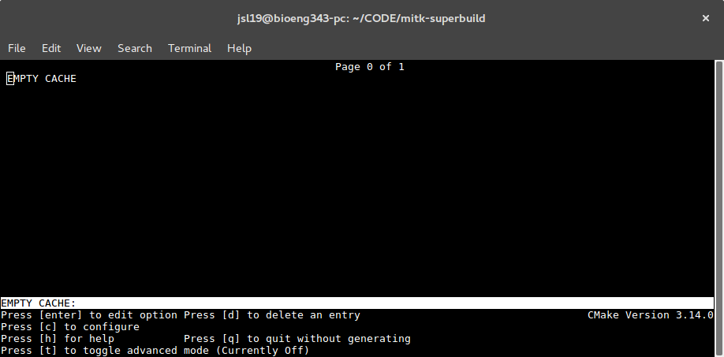
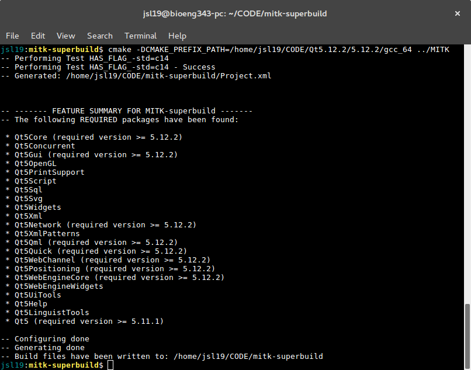
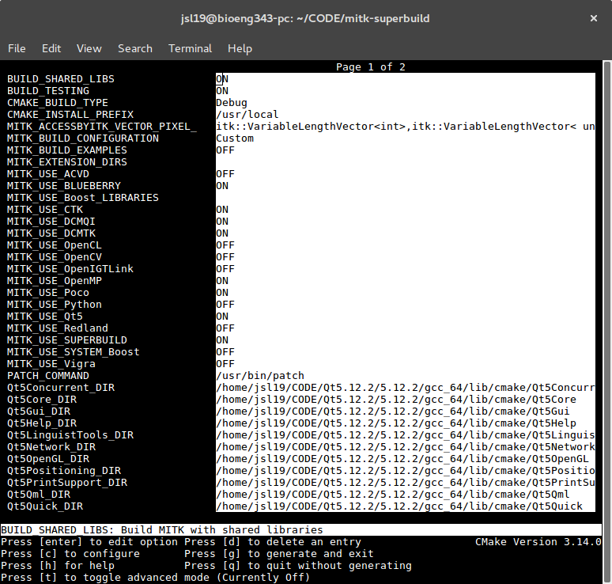
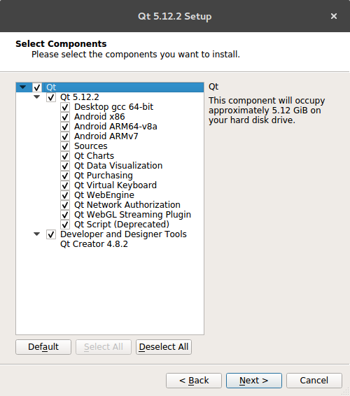

Various manuals.
# MITK Install manual

From the **Build instructions** found
[here](http://docs.mitk.org/2018.04/BuildInstructionsPage.html),
with included terminal commands and tips.
## Instalation in Ubuntu (16.04)
### Prerequisites
Some of this might have already be installed in your computer. A list of
commands to install them are included at end of this document (**Appendix**).
1. Install git: `sudo apt-get install git-core`
2. Check that you have the correct version of Cmake: `cmake --version`, you
should get an output similar to:
```
> cmake version 3.13.X
> CMake suite maintained and supported by Kitware (kitware.com/cmake).
```
If this is not the case, you might need to reinstall CMake. Go to the
**Appendix** for instructions on how to do that.

3. Get [Qt here](http://download.qt.io/official_releases/qt/5.12/5.12.2/),
using the installer appropriate open-source installer and on the latest version
(5.12).

### Clone and build the latest MITK version
```bash
git clone https://phabricator.mitk.org/source/mitk.git MITK
mkdir mitk-superbuild
cd mitk-superbuild
```
Now, to install, you need to specify the directory you have installed Qt in:
```bash
ccmake -DCMAKE_PREFIX_PATH=/PATH/TO/Qt/5.12.2/gcc_64 ../MITK
```


Press `c` to configure. If everything was installed correctly, you should see
something similar to



Press `g` to Generate.



### Compile
Once in the `mitk-build` folder, simply use the `make` command. Alternatively,
if supported by your computer, you can set the number of threads for the
installation: `make -j<n>`, where `<n>` corresponds to the number of threads
to be used, for example: `make -j6` for six threads.

# Appendix. Install prerequisites
## Reinstall CMake
1. Remove the current CMake: `sudo apt remove cmake`.
2. Download the appropriate binary distribution from
[here](https://cmake.org/download/). For a linux machine this was the
`cmake-3.14.0-Linux-x86_64.sh` file.
3. Give permissions and run executable:
```bash
chmod +x cmake-3.14.0-Linux-x86_64.sh
./cmake-3.14.0-Linux-x86_64.sh
```
4. Make `cmake` available system wide with a symbolic link:
```bash
sudo ln -s /PATH/TO/CMAKE/bin/* /usr/local/bin
```
**Do not just copy and paste the last command, instead change `/PATH/TO/CMAKE`
with the full path where you downloaded the binary.**
5. Check the instalation with `cmake --version`.

## Qt
1. Look for the appropriate installer
[here](http://download.qt.io/official_releases/qt/5.12/5.12.2/), the file
is called `qt-opensource-linux-x64-3.0.6-online.run`.
2. Either download it from the browser or with `wget`
```bash
wget http://download.qt.io/official_releases/qt/5.12/5.12.2/qt-opensource-linux-x64-5.12.2.run
```
3. Give permissions to the file and run:
```bash
chmod +x qt-opensource-linux-x64-5.12.2.run
./qt-opensource-linux-x64-5.12.2.run
```
4. Follow the instructions, when choosing to install all components, like in
the image below:



## After Qt
When you finish installing Qt, take note of the following:
+ The directory you have installed it in, referred to in this manual as
`/PATH/TO/Qt`
+ Install OpenGL libraries:
```bash
sudo apt-get install mesa-common-dev
sudo apt-get install libglu1-mesa-dev -y
```
+ Install other useful libraries and programs, in case they have not been
installed:
```bash
sudo apt-get install libfontconfig1
sudo apt-get install libxt-dev
sudo apt-get install libtiff5-dev
sudo apt install doxygen
```
## Useful resources and websites
+ https://wiki.qt.io/Install_Qt_5_on_Ubuntu
+ http://docs.mitk.org/2018.04/BuildInstructionsPage.html
+
